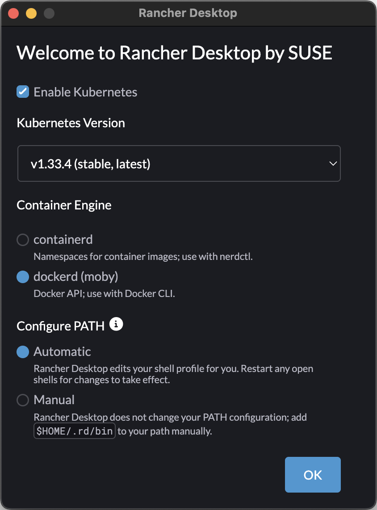
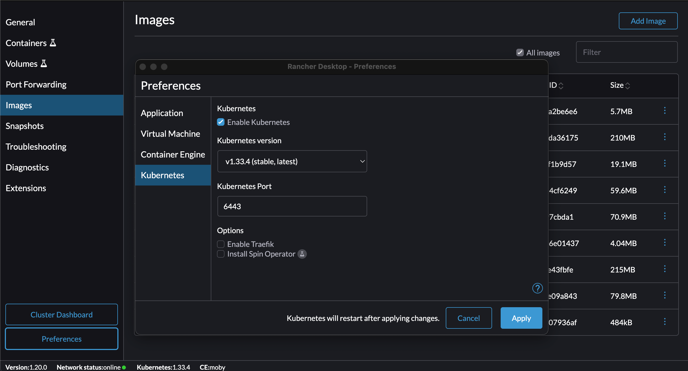
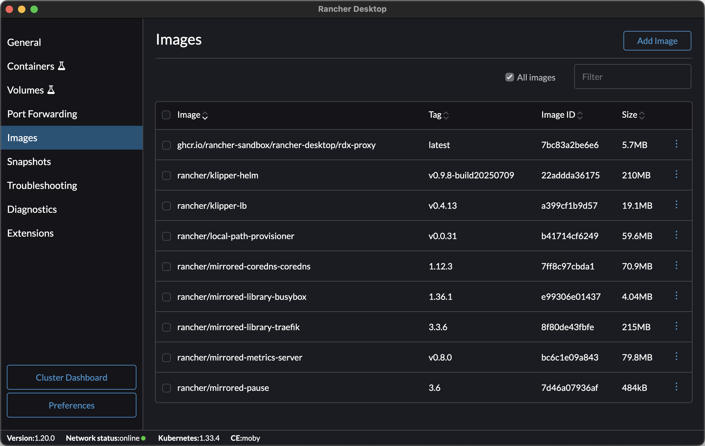
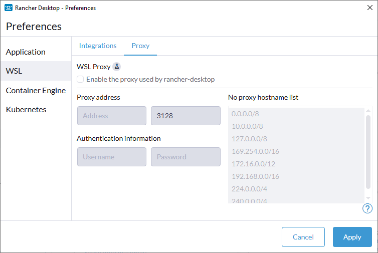

## Module 3: Understanding Kubernetes

### Prerequisites

The lightweight Kubernetes distribution `k3s` is used for the individual students to follow the Kubernetes labs.

To streamline the installation on both Windows and Linux, Rancher Desktop is used.

During the installation, the following parameters can be used to use the existing container runtime `Docker`.
Alternatively, this can be switched to `containerd` here.

In addition to the installation parameters, make sure to disable the traefik ingress controller in the settings.
If this is required, it will be installed later on seperately.

Once all settings have been accepted, the `k3s` single node cluster will be installed. For this, the below images are required.

If Windows (WSL) is used, it's possible that a proxy server needs to be configured under `Preferences - WSL`.

