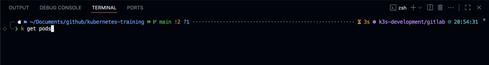

# Kubernetes Shell Setup

This provides an all-in-one guideline on how to setup your shell for working with Kubernetes in production.

The setup contains a shell theme, that will display the relevant information for Git & Kubernetes, which are crucial for DevOps workflows.

MacOS/Zsh:



## MacOS/ZSH

For MacOS and many Linux distributions, `zsh` can/should be used for universal support.

### Homebrew

```shell
/bin/bash -c "$(curl -fsSL https://raw.githubusercontent.com/Homebrew/install/HEAD/install.sh)"

# Add Brew to path
echo >> ~/.zprofile
echo 'eval "$(/opt/homebrew/bin/brew shellenv)"' >> ~/.zprofile
eval "$(/opt/homebrew/bin/brew shellenv)"
```

#### Packages

```shell
# Generic
brew update
brew install nano
brew install tree
brew install fzf
brew install shellcheck

# Terminal
brew install --cask wezterm
brew install --cask font-meslo-lg-nerd-font

brew install powerlevel10k
echo "source $(brew --prefix)/share/powerlevel10k/powerlevel10k.zsh-theme" >>~/.zshrc

brew install zsh-autocomplete
echo "source $(brew --prefix)/share/zsh-autosuggestions/zsh-autosuggestions.zsh" >> ${ZDOTDIR:-$HOME}/.zshrc

brew install zsh-syntax-highlighting
echo "source $(brew --prefix)/share/zsh-syntax-highlighting/zsh-syntax-highlighting.zsh" >> ${ZDOTDIR:-$HOME}/.zshrc

# Productivity
brew install --cask visual-studio-code

# Docker
brew install --cask docker
brew install hadolint

# Kubernetes
brew install kubectl
brew install helm
brew install velero # Backup CLI
```

### Configure Shell/Terminal

```shell
# Install OhMyZSH
sh -c "$(curl -fsSL https://raw.githubusercontent.com/ohmyzsh/ohmyzsh/master/tools/install.sh)"

# Install Powerlevel10k Theme (if not installed with brew)
# git clone --depth=1 https://github.com/romkatv/powerlevel10k.git ${ZSH_CUSTOM:-$HOME/.oh-my-zsh/custom}/themes/powerlevel10k

# Overwrite Theme in zshrc
sed -i '' 's/ZSH_THEME=".*"/ZSH_THEME="powerlevel10k\/powerlevel10k"/' ~/.zshrc

# Overwrite plugins in zshrc
sed -i '' 's/plugins=(.*)/plugins=(macos git docker ansible terraform kubectl helm)/' ~/.zshrc


# Prompt user to import or create configurations
echo "#############################################################"
echo "MANUAL STEP 1: Import P10K config `.p10k.zsh` from file OR run `p10k configure` to create your own style"
echo "-------------------------------------------------------------"
echo "MANUAL STEP 2: Import `.wezterm.lua` from file"
echo "#############################################################"

```

You can also add aliases to your terminal configuration, drastically decreasing the typing overhead.
The most common alias in Kubernetes is replacing `kubectl` simply with `k`.

```shell
echo >> ~/.zshrc
echo "# Aliases" >> ~/.zshrc

# Kubernetes
echo 'alias k="kubectl"' >> ~/.zshrc
echo 'alias v="velero"' >> ~/.zshrc
```

### Kubernetes

#### Kubernetes Plugin Manager - Krew

The `kubectl` binary itself is already very powerful, but can be extended with some very useful plugins.
The most well known are `kubectx` and `kubens` to switch Kubernetes context and namespaces. For this, the Kubernetes plugin manager `krew` is used.

```shell
(
  set -x; cd "$(mktemp -d)" &&
  OS="$(uname | tr '[:upper:]' '[:lower:]')" &&
  ARCH="$(uname -m | sed -e 's/x86_64/amd64/' -e 's/\(arm\)\(64\)\?.*/\1\2/' -e 's/aarch64$/arm64/')" &&
  KREW="krew-${OS}_${ARCH}" &&
  curl -fsSLO "https://github.com/kubernetes-sigs/krew/releases/latest/download/${KREW}.tar.gz" &&
  tar zxvf "${KREW}.tar.gz" &&
  ./"${KREW}" install krew
)

echo >> ~/.zshrc
echo '# Enable Kubernetes Plugin Manager - Krew' >> ~/.zshrc
echo 'export PATH="${KREW_ROOT:-$HOME/.krew}/bin:$PATH"' >> ~/.zshrc
```

#### Plugins

```shell
kubectl krew install ctx
kubectl krew install ns
```

#### Automatically Load Kubectl Configs

Instead of manually loading your Kubernetes config files for multiple clusters, you can use this snippet.
This loads all available configs from the `~/.kube/configs` directory whenever you launch your shell.

```shell
mkdir -p ~/.kube/configs
chmod -R 700 ~/.kube/configs

echo >> ~/.zshrc
echo '# Automatically load kubectl configs from specified directory' >> ~/.zshrc
echo 'export KUBECONFIG_FILES=(~/.kube/configs/*)' >> ~/.zshrc
echo 'export KUBECONFIG=$(IFS=:; echo "${KUBECONFIG_FILES[*]}")' >> ~/.zshrc
source ~/.zshrc
```

When using this approach, make sure to properly name your config file, `context` and `cluster name`.
This will make it much easier to identify the cluster context using `kubectl ctx`.

```yaml
# example: ~/.kube/configs/development-k3s.yaml

apiVersion: v1
clusters:
  - cluster:
      certificate-authority-data:
      server: https://k3s.test.local:8443
    name: k3s-development
contexts:
  - context:
      cluster: k3s-development
      user: k3s-development
    name: k3s-development
current-context: k3s-development
kind: Config
preferences: {}
users:
  - name: k3s-development
    user:
      client-certificate-data:
      client-key-data:
```

## Windows

On Windows, the setup is limited a lot by the general compatibility of certain functionalities.
Generally it's advised to use a Linux distribution of choice inside the Windows Terminal using WSL2.

### Terminal

You can still use Wezterm, as your terminal emulator, but this time using either Oh-my-Posh or Starship for the theming.
As explained and seen above, these themes will display the relevant information for Git & Kubernetes, which are crucial for DevOps workflows.

- [WezTerm](https://wezterm.org/shell-integration.html#osc-7-on-windows-with-cmdexe)
- [Oh-my-Posh](https://ohmyposh.dev/docs/installation/windows)
- [Krew](https://krew.sigs.k8s.io/docs/user-guide/setup/install/#windows)
- [Fuzzy finder](https://github.com/junegunn/fzf?tab=readme-ov-file#windows-packages)
