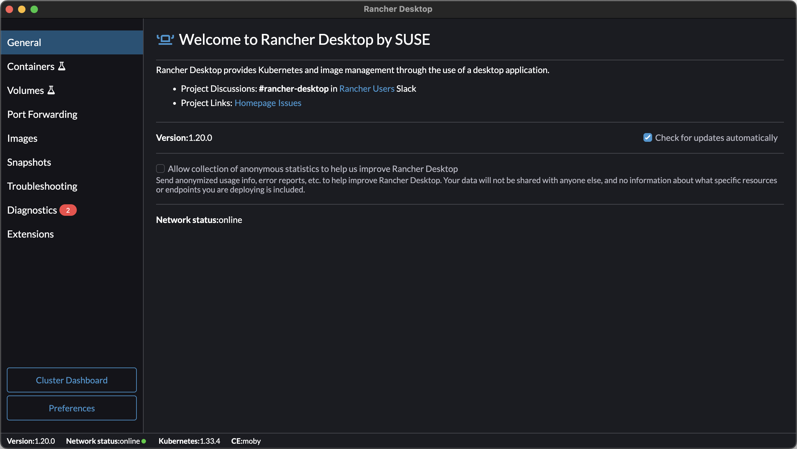
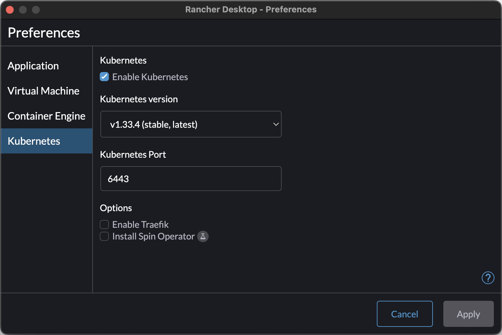
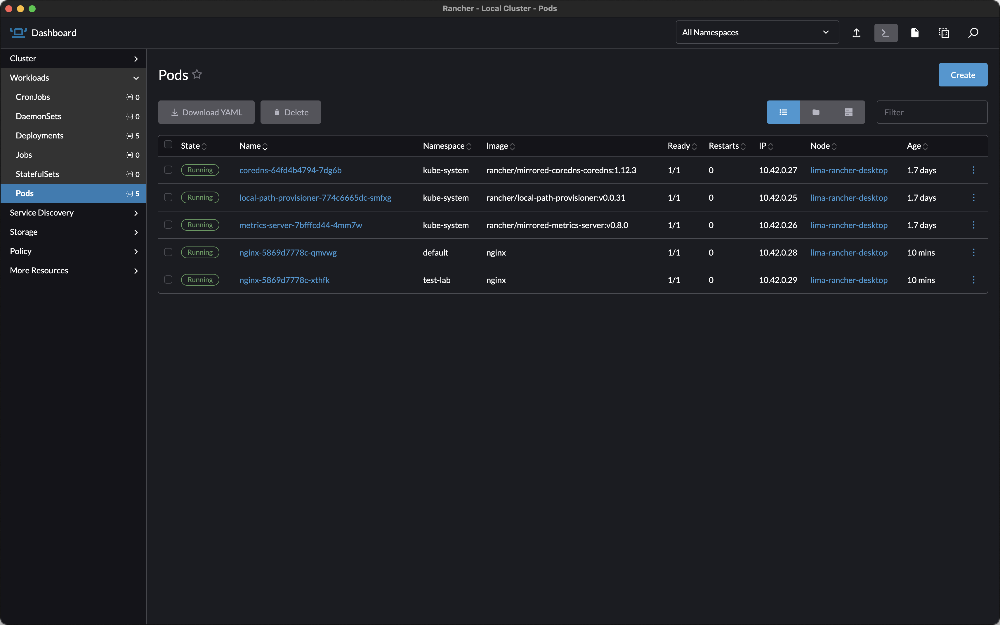
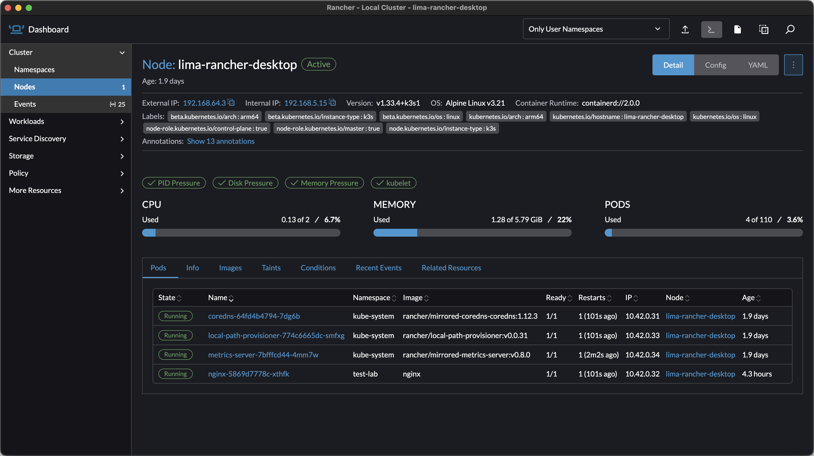
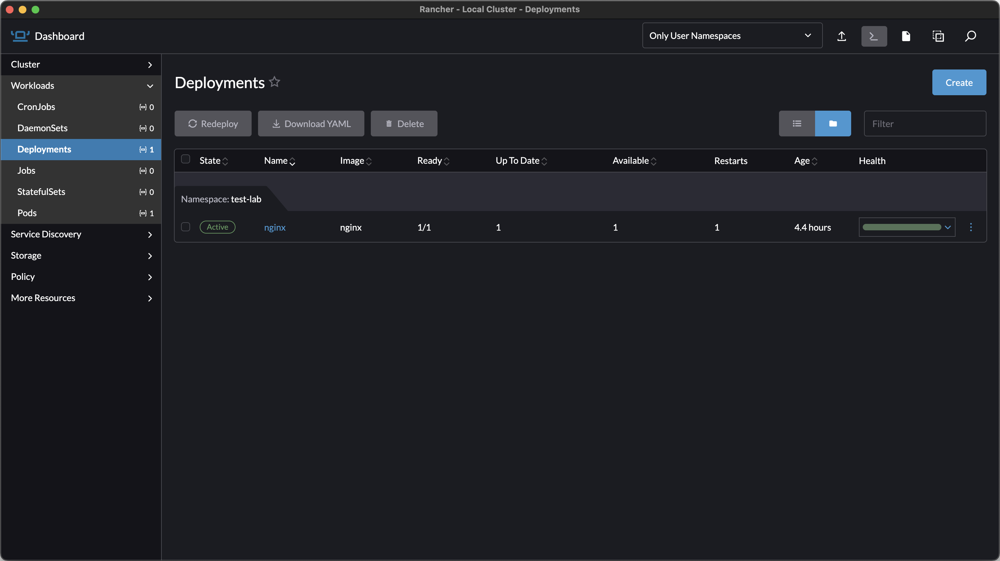
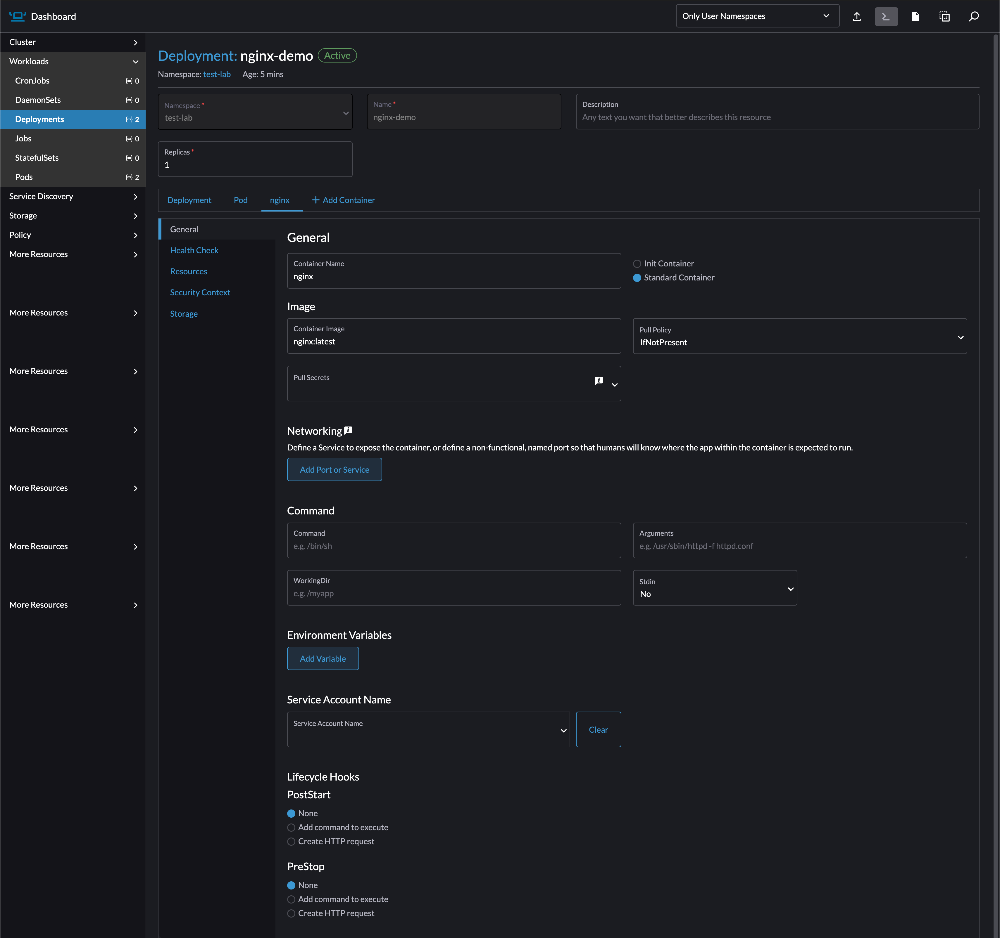
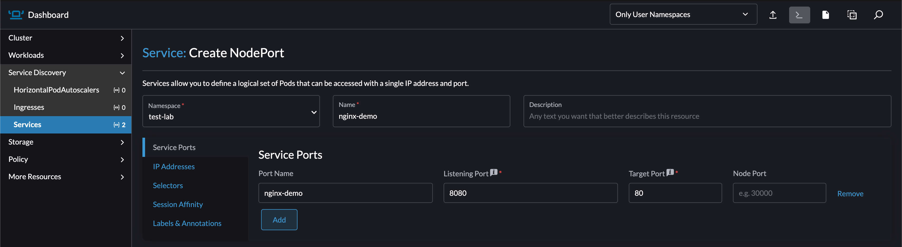
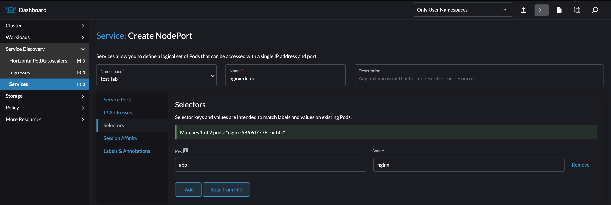
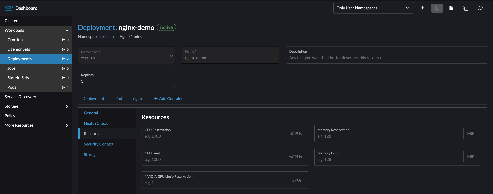

# k3s Lab Guide

## Objective

Set up and explore a local k3s Kubernetes cluster using Rancher Desktop, transitioning from Docker container management to Kubernetes orchestration.

## Prerequisites

- Rancher Desktop installed
- Basic familiarity with command-line interface
- Understanding of Docker concepts from previous modules

---

## Lab Setup: Enable k3s in Rancher Desktop

### GUI Configuration Steps

1. **Open Rancher Desktop application**
2. **Navigate to Kubernetes settings**

   

3. **Enable Kubernetes** if not already activated
4. **Select containerd as container runtime**
5. **Configure resource allocation:**
   - Memory: 4GB minimum
   - CPU: 2 cores minimum
6. **Apply changes and restart**

   

### Verification Commands

**Test cluster connectivity:**

```shell
# Check cluster status
kubectl cluster-info

# Verify node is ready
kubectl get nodes

# Confirm kubectl configuration
kubectl config current-context
```

**Expected output:**

```plaintext
Kubernetes control plane is running at https://127.0.0.1:6443
CoreDNS is running at https://127.0.0.1:6443/api/v1/namespaces/kube-system/services/kube-dns:dns/proxy

rancher-desktop    Ready    control-plane,master   5m    v1.28.x+k3s1

rancher-desktop
```

**GUI verification:**

1. Navigate to Cluster section in Rancher Desktop
2. Confirm node shows as healthy
3. Check resource utilization

---

## Explore Kubernetes Components

### Discover System Pods

**List all system components:**

```shell
# View all namespaces
kubectl get namespaces

# List system pods
kubectl get pods --all-namespaces

# Focus on control plane components
kubectl get pods -n kube-system
```

**GUI exploration:**

1. Navigate to **Workloads → Pods**
2. Filter by **kube-system** namespace
3. Identify control plane components



### Component Identification Exercise

**Map running pods to Kubernetes architecture:**

| Pod Name Pattern | Component | Function |
|------------------|-----------|----------|
| `kube-apiserver-*` | API Server | Cluster API endpoint |
| `etcd-*` | etcd | State storage |
| `kube-scheduler-*` | Scheduler | Pod placement |
| `kube-controller-manager-*` | Controller Manager | State management |
| `coredns-*` | DNS | Service discovery |
| `kube-proxy-*` | Network Proxy | Service networking |

### Check Component Health

**CLI health verification:**

```shell
# Detailed node information
kubectl describe node rancher-desktop

# Component status (deprecated)
# kubectl get componentstatuses

# Component Status
kubectl get --raw='/readyz?verbose'

# System resource usage
kubectl top nodes
kubectl top pods -n kube-system
```

**GUI resource monitoring:**

1. Navigate to **Cluster → Nodes**
2. View CPU and memory utilization
3. Monitor system pod resources

   

---

## Docker to Kubernetes Command Translation

### Basic Container Operations

**Docker commands:**

```shell
# List containers
docker ps

# Run nginx
docker run -d --name nginx-demo -p 8080:80 nginx

# View logs
docker logs nginx-demo

# Stop and remove
docker stop nginx-demo
docker rm nginx-demo
```

**Kubernetes equivalents:**

```shell
# List pods
kubectl get pods

# Create deployment
kubectl create deployment nginx-demo --image=nginx

# View logs
kubectl logs deployment/nginx-demo

# Delete deployment
kubectl delete deployment nginx-demo
```

**GUI comparison:**

- **Docker/Rancher**: Containers
- **Kubernetes**: Workloads → Deployments

   

### Application Deployment Exercise

**Deploy nginx to Kubernetes:**

```shell
# Create deployment (create manifest)
kubectl create deployment nginx --image=nginx:latest

# kubectl create deployment nginx --image=nginx:latest --dry-run=client -o yaml > deployment.yaml

# Check deployment status
kubectl get deployments
kubectl get pods

# View deployment details
kubectl describe deployment nginx
```

**GUI deployment:**

1. Navigate to **Workloads → Deployments**
2. Click **Create Deployment**
3. Configure image: `nginx:latest`
4. Set name: `nginx`
5. Deploy and monitor



### Service Creation and Networking

**Expose deployment as service:**

```shell
# Create NodePort service
# NodePort: Directly mapped on the kubernetes worker node
kubectl expose deployment nginx-demo --port=80 --type=NodePort

# ClusterIP: (Default) Internal IP meant for use with LoadBalancer
# kubectl create service clusterip nginx-demo --tcp=8080:80 --dry-run=client -o yaml > service.yaml

# Find assigned port
kubectl get services

# Test connectivity
curl http://localhost:[ASSIGNED-PORT]

```

**GUI service creation:**

1. Navigate to **Service Discovery → Services**
2. Click **Create Service**
3. Target deployment: `nginx-demo`
4. Configure port mapping

   

   

**Verify service functionality:**

```shell
# Check service details
kubectl describe service nginx-demo

# List service endpoints
kubectl get endpoints nginx-demo
```

---

## Application Scaling and Management

### Horizontal Scaling

**Scale deployment:**

```shell
# Scale to 3 replicas
kubectl scale deployment nginx-demo --replicas=3

# Watch pods being created
kubectl get pods -w

# Check final status
kubectl get pods -o wide
```

**GUI scaling:**

1. Navigate to **Workloads → Deployments**
2. Select `nginx-demo` deployment
3. Edit replica count to 3
4. Observe pod creation

   

### Self-Healing Demonstration

**Test automatic pod replacement:**

```shell
# List running pods
kubectl get pods

# Delete one pod
kubectl delete pod [POD-NAME]

# Watch automatic replacement
kubectl get pods -w
```

**GUI pod management:**

1. Navigate to **Workloads → Pods**
2. Delete a pod using the interface
3. Observe automatic recreation

---

## Configuration and Resource Management

### Environment Variables and Configuration

**Add environment variables to deployment:**

```shell
# Update deployment with environment variable
kubectl set env deployment/nginx-demo ENVIRONMENT=development

# Verify configuration
kubectl describe deployment nginx-demo
```

**GUI environment variables:**

1. Navigate to **Workloads → Deployments → Select + Edit Config**
2. Select Tab with container name
3. Add environment variable as key/value pair

### Resource Limits

**Set resource constraints:**

```shell
# Add/Edit resource limits (Kube-API)
kubectl patch deployment nginx-demo -p '{"spec":{"template":{"spec":{"containers":[{"name":"nginx","resources":{"limits":{"cpu":"100m","memory":"128Mi"}}}]}}}}'

# Edit resource limits (Editor, interactive)
kubectl edit deployment nginx-demo

# Verify resource limits
kubectl describe deployment nginx-demo
```

**GUI environment variables:**

1. Navigate to **Workloads → Deployments → Select + Edit Config**
2. Select Tab with container name
3. Select "Resources" tab
4. Adjust resource requests and limits

   

---

## Troubleshooting and Debugging

### Common Issues and Solutions

**Pod won't start:**

```shell
# Check pod events
kubectl describe pod [POD-NAME]

# View pod logs
kubectl logs [POD-NAME]

# Check cluster events
kubectl get events --sort-by=.metadata.creationTimestamp
```

**Service connectivity problems:**

```shell
# Verify service configuration
kubectl get services
kubectl describe service [SERVICE-NAME]

# Check service endpoints (internal)
kubectl get endpointslices

# Test from within cluster
kubectl run test-pod --image=busybox -it --rm -- /bin/sh
# Inside pod: wget -qO- http://service-name

# Test from within the same pod
kubectl debug -it [TARGET_POD] --image=busybox --target=[TARGET_CONTAINER]
```

**GUI troubleshooting:**

1. Navigate to failing resource
2. Check **Events** tab for error messages
3. Review **Logs** tab for application output

### Debugging Commands Reference

| Issue | Command | GUI Location |
|-------|---------|--------------|
| Pod not starting | `kubectl describe pod` | Pod → Events tab |
| Application errors | `kubectl logs pod-name` | Pod → Logs tab |
| Service not accessible | `kubectl describe service` | Service → Details |
| Resource constraints | `kubectl top pods` | Workloads → Resource usage |
| Network connectivity | `kubectl get endpointslices` | Service Discovery → Endpoints |

---

## GUI Navigation Reference

### Main Interface Overview

**Rancher Desktop sections:**

- **Container Management**: Docker containers and images
- **Kubernetes**: Cluster resources and workloads
- **Images**: Container registry management
- **Troubleshooting**: System diagnostics

### Kubernetes Navigation Structure

**Primary sections:**

- **Workloads**: Deployments, Pods, ReplicaSets, Jobs
- **Service Discovery**: Services, Ingress controllers
- **Config**: ConfigMaps, Secrets
- **Storage**: PersistentVolumes, StorageClasses

### Command-to-GUI Mapping

| kubectl Command | GUI Location | Purpose |
|----------------|--------------|---------|
| `kubectl get nodes` | Cluster → Nodes | Cluster health |
| `kubectl get pods` | Workloads → Pods | Running applications |
| `kubectl get deployments` | Workloads → Deployments | Application management |
| `kubectl get services` | Service Discovery → Services | Network access |
| `kubectl logs [pod]` | Pod details → Logs | Application output |
| `kubectl describe [resource]` | Resource → Overview | Detailed information |

---

## Practical Exercises

### Exercise 1: Deploy a Web Application

**Objective**: Deploy and expose a simple web application

**Steps:**

1. Create deployment with `httpd` image
2. Scale to 2 replicas
3. Expose as NodePort service
4. Test accessibility from browser
5. Scale to 4 replicas and observe load balancing

**Commands:**

```shell
kubectl create deployment web-app --image=httpd:latest
kubectl scale deployment web-app --replicas=2
kubectl expose deployment web-app --port=80 --type=NodePort
kubectl get services
# Test with browser at localhost:[assigned-port]
kubectl scale deployment web-app --replicas=4
```

### Exercise 2: Configuration Management

**Objective**: Configure application with environment variables

**Steps:**

1. Create deployment with environment variables
2. Update configuration without downtime
3. Verify configuration changes

**Commands:**

```shell
kubectl create deployment config-demo --image=nginx
kubectl set env deployment/config-demo APP_VERSION=v1.0 ENVIRONMENT=development
kubectl rollout status deployment/config-demo
kubectl describe deployment config-demo
```

### Exercise 3: Application Updates

**Objective**: Perform rolling update of application

**Steps:**

1. Deploy application with specific image tag
2. Update to newer image version
3. Monitor rolling update process
4. Rollback if needed

**Commands:**

```shell
kubectl create deployment update-demo --image=nginx:1.20
kubectl set image deployment/update-demo nginx=nginx:1.21
kubectl rollout status deployment/update-demo
kubectl rollout history deployment/update-demo
# If rollback needed:
kubectl rollout undo deployment/update-demo
```

---

## Cleanup and Resource Management

### Remove Lab Resources

**Delete created resources:**

```shell
# Remove specific deployments
kubectl delete deployment nginx-demo web-app config-demo update-demo

# Remove associated services
kubectl delete service nginx-demo web-app

# Verify cleanup
kubectl get deployments
kubectl get services
kubectl get pods
```

**GUI cleanup:**

1. Navigate to **Workloads → Deployments**
2. Select deployments to remove
3. Delete using interface
4. Confirm in **Service Discovery → Services**

### Resource Monitoring

**Check cluster resource usage:**

```shell
# Node resource utilization
kubectl top nodes

# Pod resource consumption
kubectl top pods

# Namespace resource usage
kubectl top pods --all-namespaces
```

---

## Learning Validation Checklist

### Technical Skills Acquired

- [ ] k3s cluster operational via Rancher Desktop
- [ ] Basic kubectl commands for resource management
- [ ] Service creation for application networking
- [ ] GUI navigation for common Kubernetes operations
- [ ] Application deployment and scaling

### Conceptual Understanding

- [ ] Kubernetes vs Docker operational differences
- [ ] Declarative vs imperative resource management
- [ ] Self-healing and automatic scaling mechanisms
- [ ] Service discovery and load balancing concepts

### Practical Capabilities

- [ ] Deploy applications from container images
- [ ] Scale applications horizontally
- [ ] Expose applications through services
- [ ] Troubleshoot common deployment issues
- [ ] Navigate both CLI and GUI tools effectively

---

## Next Steps

This lab establishes the foundation for advanced Kubernetes operations. Future modules will cover:

- **Advanced Deployments**: YAML manifests, rolling updates, rollbacks
- **Configuration Management**: ConfigMaps, Secrets, environment management
- **Storage**: Persistent volumes and stateful applications
- **Networking**: Ingress controllers, network policies
- **Production Patterns**: Best practices, monitoring, security

The k3s environment configured here serves as your learning platform for all subsequent Kubernetes modules.
